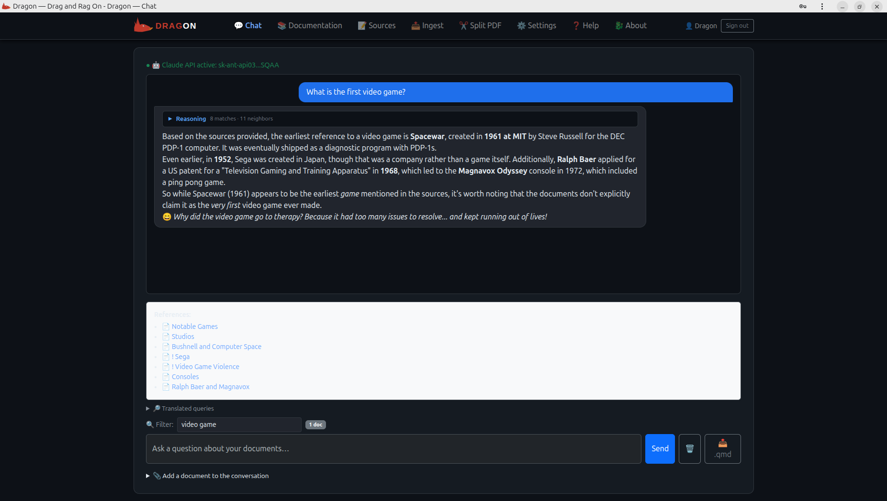

<p align="center">
  
</p>

# Dragon — Drag and Rag On

A local RAG (*Retrieval-Augmented Generation*) application to query your documents (PDF, DOCX, PPTX, etc.) and get answers from Claude with clickable links to the source sections.


<p align="center">
  
</p>


→ **[Full installation guide](INSTALL.md)**

---

## How it works

```
    Your documents (PDF · DOCX · PPTX · HTML · MD · XLSX)
                         │
                  process_documents.py
                         │
          ┌──────────────┴──────────────┐
          │                             │
    Quarto pages (.qmd)          JSON chunks
    → navigable HTML site        text fragments
      (port 8080)                + metadata
                                       │
                              ChromaDB (vector store)
                           all-MiniLM-L6-v2 (local)


    User question
          │
    Claude (translation EN + FR)
          │
    ChromaDB × 2 queries
          │
    Top N merged chunks
          │
    Claude (answer)
          │
    ┌─────┴──────────────────────────┐
    Text answer            Clickable references
                        → links to HTML sections
```

---

## Quick start

```bash
# 1. Activate the environment
source env/bin/activate

# 2. Launch the application
python3 app_flask.py

# 3. Open in your browser
#    http://localhost:7860
```

For the initial installation, see **[INSTALL.md](INSTALL.md)**.

---

## Main files

| File | Role |
|---|---|
| `app_flask.py` | Flask web application (main interface) |
| `process_documents.py` | Document → QMD + chunks conversion |
| `embed_and_query.py` | ChromaDB indexing via command line |
| `requirements.txt` | Python dependencies |
| `INSTALL.md` | Detailed installation guide |

---

## Dependencies

| Package | Role |
|---|---|
| `flask` | Web interface |
| `anthropic` | Claude API (translation + answers) |
| `docling` | Document conversion |
| `chromadb` | Local vector store |
| `sentence-transformers` | Local embedding model |
| `quarto` | HTML documentation rendering (installed separately) |

---

## Ingest a directory

```bash
python ingest_dir.py doc_input/ --output doc_output/ --db .chroma_db
```
